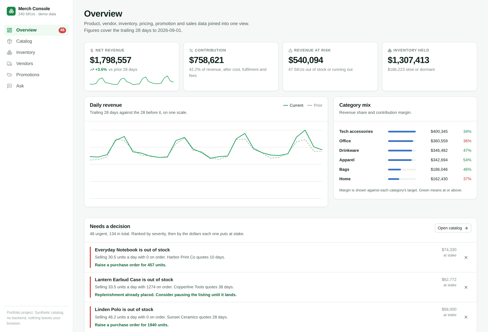
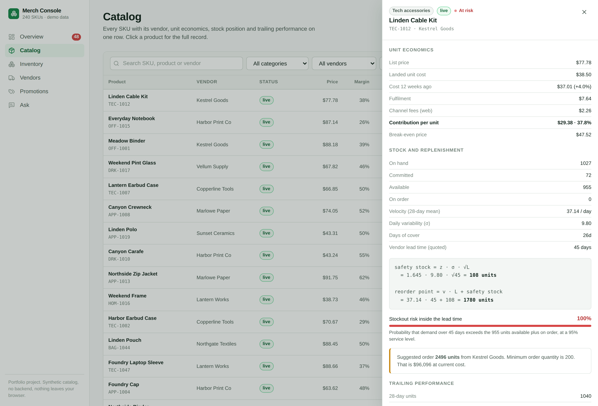
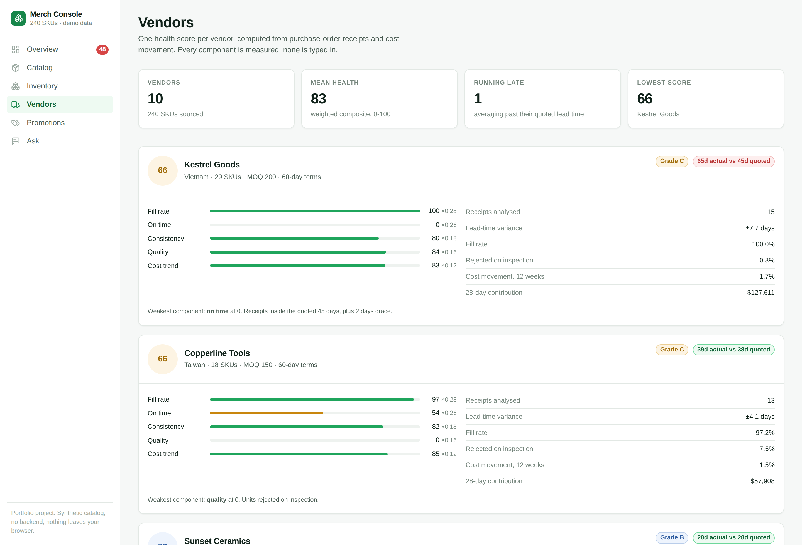
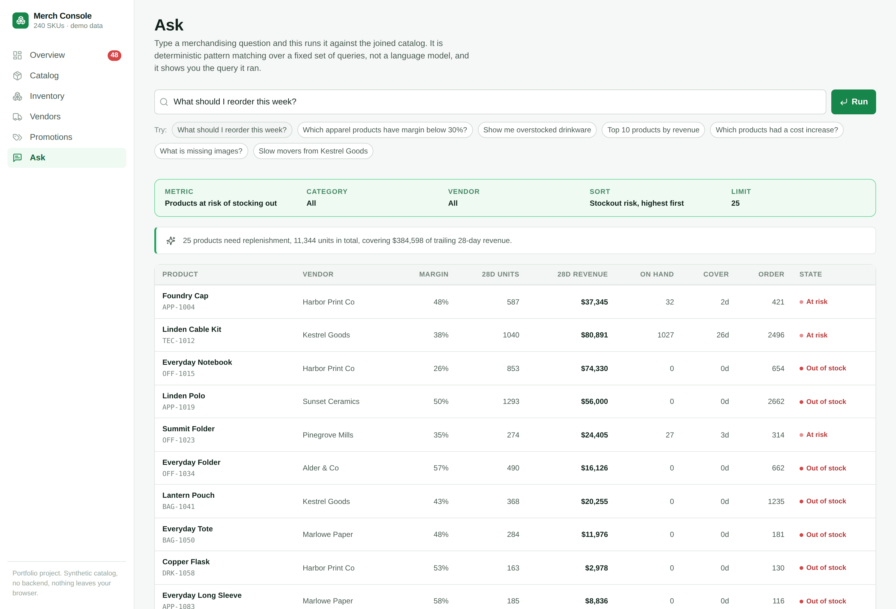

# Merch Console

**A merchandising operations console.** Product, vendor, inventory, pricing, promotion and sales data joined into one model, with continuous-review inventory planning, measured vendor scoring and promotion break-even analysis on top of it.

[The problem](#the-problem) · [Inventory risk](#inventory-risk) · [Unit economics](#unit-economics-and-promotions) · [Vendor scoring](#vendor-scoring) · [The question box](#the-question-box) · [Running it](#running-it) · [Limitations](#limitations)

<!-- Add the live demo link here once the site is deployed. -->



---

## Background

I spent a summer in product operations and merchandising, where the daily work meant moving between a catalog tool, a vendor spreadsheet, an inventory export and a promotions calendar to answer questions that spanned all four. "What do I need to reorder, and which of those actually matter?" required pulling four files and a pivot table.

This is my own build of the tool that question implies. It is not my employer's system: there is no company data, schema, workflow or code here, the catalog is generated from a fixed seed, and the vendors and products are invented. What carries over is the shape of the problem and the merchandising math, which is public and standard.

It is a personal portfolio project.

---

## The problem

A merchandiser's questions cross entity boundaries, and the tooling usually does not.

- *What should I reorder?* needs sales velocity, current stock, vendor lead time and minimum order quantity.
- *Is this SKU actually profitable?* needs price, landed cost, fulfilment cost and channel fee.
- *Is this promotion working?* needs unit economics and observed volume, together.
- *Which vendor is the problem?* needs purchase-order receipts, not an opinion.

So the console is built on one joined model, and every screen reads the same rows. The interesting work is in what gets computed on top.

---

## Inventory risk

The question is not "what is low" but **"what will run out before a replacement arrives, and what is that worth?"** Those orderings disagree constantly. A cheap SKU with two units left looks alarming and is worth $30. A high-velocity SKU sitting just under its reorder point on a 45-day lead time looks fine on a shelf and is worth thousands.

Standard continuous-review model:

```
velocity        v    = mean daily units over 28 days
variability     σ    = standard deviation of those daily units
safety stock    SS   = z · σ · √L          (z = 1.645, 95% service level)
reorder point   ROP  = v · L + SS
stockout risk        = P(demand over L > available + on order)
```

**Two things here are easy to get wrong, and both change the answer materially.**

The first is the **√L**. Variance adds over independent days, so the standard deviation of lead-time demand grows with the square root of lead time, not in proportion to it. Doing it linearly overstates safety stock badly on long-lead vendors — and this catalog has one quoting 45 days. There is a test that fails if anyone "fixes" this to be linear.

The second is **days with no rows are days with no sales, not missing data**. Averaging only the days present in the sales table inflates velocity for every slow mover in the catalog, which is most of it. Also tested.

Stockout risk is the normal CDF of lead-time demand against available supply, which turns "low stock" into a probability that can be ranked and multiplied by margin to get dollars at risk. That is what the replenishment screen sorts on.



Every product shows the arithmetic with its own numbers substituted. A merchandiser being asked to commit $96,000 on a suggested order will want to know where the number came from, and "the system said so" is how these tools stop being used.

---

## Unit economics and promotions

The console reports **contribution margin**, not gross margin. A SKU at 42% gross that carries $7 of fulfilment and a 15% marketplace fee is a different business from one at 42% that ships in an envelope.

```
contribution = price − landed cost − fulfilment − (price × channel fee)
```

The channel fee uses the **worst** channel the product is listed on, not an average. Any given unit can sell through the expensive one, and averaging reports a margin the product only achieves on a favourable mix — the optimistic assumption in exactly the place it does the most damage.

**Break-even lift** is the centrepiece of the promotions screen:

```
required lift = CM₀ / CM₁ − 1
```

On a 45% contribution margin, 20% off needs roughly **80% more units just to hold contribution flat**. This is the most useful number in promotional merchandising and it is almost never on the screen where the discount gets chosen, which is how "20% off sounds reasonable" becomes a quarter of margin nobody can account for. When the discounted price contributes nothing, required lift is infinite — that is what "below cost" means, and no volume recovers it.

---

## Vendor scoring

One health score per vendor, always shown opened up:

```
score = 0.28·fill rate + 0.26·on time + 0.18·consistency + 0.16·quality + 0.12·cost trend
```

Every component is computed from purchase-order receipts and cost movement. None is a judgement someone typed in. A test asserts the components recompute to the headline, because otherwise the transparency is decorative.

Two calibration decisions worth naming:

**Consistency carries real weight.** A vendor who is reliably slow can be planned around; one who is erratic cannot. Lead-time variance is paid for directly in safety stock — it is the σ in the formula above — so it belongs in the score rather than in a footnote.

**Quality is scored against a 5% rejection floor, not against 100%.** Dividing by 100% made a 12% reject rate score 88, a comfortable pass for a vendor sending back one box in eight. I caught this because the vendor I had deliberately planted with a quality problem was still grading an A.



---

## The alert engine

Eight rules over the joined rows: stockout, stockout risk, below-cost pricing, margin erosion from cost drift, overstock, catalog hygiene, promotions priced below cost, and promotions not covering their break-even lift.

Each alert states **the numbers that made it fire** and **what to do**. An alert you have to go and investigate before you can act on it is a task, not an alert.

Ranking is by severity, then by dollars at stake. A stockout on a SKU doing $40 a month and one doing $4,000 are not the same alert, and sorting by rule type buries the second behind a page of the first. That is the difference between an alert list people use and one they turn off.

---

## The question box

Deterministic pattern matching over eight query shapes, each accepting a category, vendor, percentage threshold and row limit parsed from the question. **It is not a language model, and the screen says so in its first sentence.**

It shows the parsed query above the results, and when nothing matches it says so and lists what it can answer rather than guessing.



This is a deliberate product decision, not a limitation I am dressing up. A chat-shaped input that silently produces plausible nonsense outside its patterns is worse than a dropdown, because nobody can tell an answer from a guess. Showing the query makes every result checkable.

A production version would put a model in front of this to widen what it understands — but the layer underneath would stay. The model picks the query; the query is still shown. The answer is then correct by construction rather than correct if the model behaved.

---

## The synthetic data

240 SKUs, 10 vendors, 6 categories, 90 days of daily sales, 8 promotions and ~120 purchase-order receipts, all from one seed.

Generating flat data would have made the console look fine and told me nothing, so it deliberately produces:

- **A Pareto-ish revenue distribution** — the top fifth of SKUs carries over half the revenue. Tested.
- **Weekday, trend and weekly shape** in demand, so velocity variance is real rather than artificial. Daily units are Poisson draws, not rounded gaussians, because a rounded gaussian produces negative days and the wrong variance at low volume.
- **Planted problems**: one vendor chronically late and erratic, one with a quality problem, one pushing costs up without a price response, plus below-cost pricing, dead stock and missing images. Named in the generator so tests can assert the console finds them.

Three data bugs were caught by looking at the output rather than the tests:

1. **Two-thirds of inventory value read as dead stock.** Overstock was drawn uniformly, which put 300 days of cover on the top sellers. Real overstock lands on slow movers, so the draw is now biased by velocity.
2. **Tech accessories showed an 11% margin.** Fulfilment cost was a flat uniform draw, putting $6 of shipping on $10 products. It now scales with price. Landed cost is also solved backwards from contribution margin rather than gross, since contribution is what every screen reports.
3. **The dashboard opened on a 13% decline.** The seasonal curve was a sine across the whole window, which put the peak 45 days back. An artefact of the curve, not a business.

---

## Architecture

```
src/
├── lib/
│   ├── rng.ts         mulberry32, Box-Muller, Poisson. Every synthetic number starts here
│   ├── generate.ts    the catalog, sales history, receipts and promotions
│   ├── types.ts       the unified model
│   ├── inventory.ts   velocity, safety stock, reorder point, stockout probability
│   ├── margin.ts      contribution, break-even price, promotion break-even lift
│   ├── vendors.ts     the weighted health composite
│   ├── select.ts      the joins, indexed once
│   ├── alerts.ts      eight rules, ranked by severity then dollars
│   └── ask.ts         query parsing and execution
├── state/useConsole.ts  the one stateful hook
└── components/          presentational; no business logic
```

**`lib/` is pure TypeScript with no React import.** Every piece of interesting behaviour is testable without mounting anything, which is why there are 80 tests and no test renderer.

The generated dataset is immutable. User edits are held separately and applied on read, so the catalog can be changed and reset without ever mutating the source, and every derived figure recomputes down the same path whether or not anything has been edited.

---

## Running it

```bash
npm install
npm run dev        # http://localhost:5173
```

```bash
npm test           # 80 tests
npm run typecheck  # strict, with noUncheckedIndexedAccess
npm run lint
npm run build      # static bundle in dist/
```

Screenshots are generated against the production build, and the script fails on any console error, so it doubles as a smoke test of every screen:

```bash
npm run build && npm run preview
node scripts/shoot.mjs
```

**Deploying.** Fully static. `netlify.toml` sets the build, publish directory, SPA redirect and security headers. Any static host works.

**Environment.** There are none. `.env.example` exists to document that the app takes no configuration and holds no secrets.

---

## Testing

80 tests, all on the logic:

- **inventory** — velocity counts zero-sale days, √L scaling (explicitly asserted against linear), normal CDF against known quantiles, risk monotonic in stock and lead time, MOQ respected, suggested order lands above the reorder point so it does not immediately trip again
- **margin** — the worst-channel fee rule, break-even price yields exactly zero contribution, break-even lift against the closed form, the 45%-margin/20%-off case the README quotes, infinite lift below cost
- **data** — determinism across runs, referential integrity, no receipt before its order, the Pareto property, every inventory state present, the planted problems findable
- **vendors** — components weight to exactly 1, the composite recomputes from the components shown, grades consistent with scores, the late and low-quality vendors identified
- **alerts** — every alert has a detail and an action, ids unique, sort order holds across the whole list, one below-cost alert per loss-making SKU, no stock alerts on dead SKUs
- **ask** — metric, category, vendor, threshold and limit parsing; returns null rather than guessing; results sorted the way the query claims

---

## Limitations

- **Demand during lead time is modelled as normal.** For very slow movers it is closer to Poisson, and the normal approximation misstates the tail — which is exactly where a stockout probability lives. Fine at the volumes most of this catalog runs at, wrong for the long tail.
- **Velocity is a flat 28-day mean.** No trend term, no seasonal decomposition, no promotional adjustment. A SKU whose sales doubled last week looks the same as one that has been flat. Exponential smoothing with a trend component would be the first real improvement.
- **Lead times are the vendor's quoted figure, not their measured one.** The console computes actual lead time on the vendors screen and then does not feed it back into the planning math. It should: a vendor quoting 45 days and delivering 65 is under-provisioning every SKU they supply. This is the single highest-value thing left undone.
- **No purchase-order workflow.** Suggested orders export to CSV; there is nothing to approve, send or receive against.
- **No cost of capital in the overstock rule.** Dead stock is flagged by days of cover and value, with no carrying-cost or markdown-curve model behind the "what should this be worth" question.
- **The question box is pattern matching**, covered above.
- **240 rows filter in memory.** At 50,000 SKUs the catalog table needs virtualisation and the joins need to move behind an API. Saying that is more useful than pretending a windowing library was needed here.
- **No automated accessibility audit in CI.** Keyboard operability, focus management on the drawer, skip link, labelled controls, sortable headers with `aria-sort` and reduced-motion support are implemented and manually verified; an axe pass in CI is the obvious next step.

---

## Licence

MIT — see [LICENSE](LICENSE).

Built by [Harlie Katz](https://harliekatz.netlify.app). All products, vendors, prices, receipts and sales in this application are synthetic and generated from a fixed seed. It contains no employer data, schema or code.
